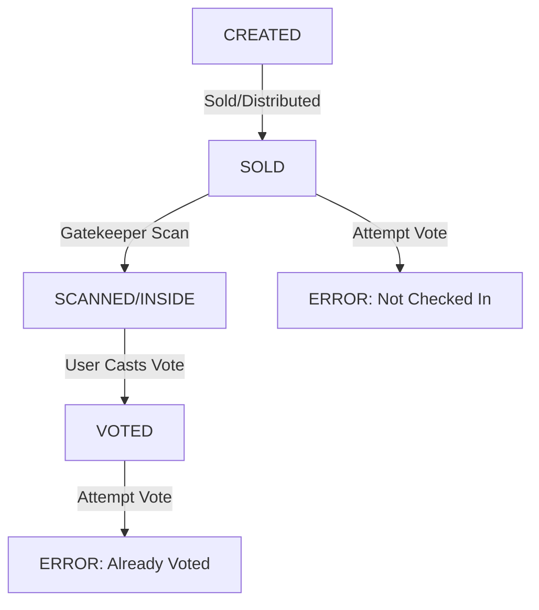

# Phase 2: Technical Architecture

## 1. Database Schema (PostgreSQL)

### Table: `AccessCodes` (The Tickets)
| Column | Type | Description |
| :--- | :--- | :--- |
| `id` | UUID | Primary Key. |
| `code` | VARCHAR(16) | The short alphanumeric code used in the URL (Unique, Indexed). |
| `status` | ENUM | `CREATED`, `SOLD`, `SCANNED`, `VOTED`, `INVALID`. |
| `scanned_at` | TIMESTAMP | Time of entry (Gatekeeper scan). |
| `voted_at` | TIMESTAMP | Time of vote submission. |
| `created_at` | TIMESTAMP | Default NOW(). |

*Note: We may want to separate `status` into `is_inside` (boolean) and `has_voted` (boolean) for cleaner logic.*

### Table: `Votes`
| Column | Type | Description |
| :--- | :--- | :--- |
| `id` | SERIAL | Primary Key. |
| `access_code_id` | UUID | FK to `AccessCodes.id`. Enforces 1-vote-per-ticket. |
| `category` | VARCHAR | 'DANCING', 'SINGING', 'BAND'. |
| `candidate_id` | UUID/INT | The ID of the performer voted for. |
| `timestamp` | TIMESTAMP | Default NOW(). |

---

## 2. API Routes & Logic

### A. Gatekeeper API
`POST /api/scan`
- **Auth**: Master QR Token (Session-based after scan).
- **Body**: `{ code: string }`
- **Logic**:
    1.  Find `AccessCode` by `code`.

    2.  If not found -> Return `404 INVALID`.
    3.  If `scanned_at` is NOT null -> Return `409 ALREADY_SCANNED`.
    4.  Else -> Update `scanned_at = NOW()`, return `200 OK`.

### B. Voting API
`GET /vote` (Middleware)
- **Logic**:
    1.  Extract `code` from query param or session.
    2.  Check `AccessCode`:
        - if `scanned_at` is NULL -> Redirect to "You must enter the event first".
        - if `voted_at` is NOT NULL -> Redirect to "You have already voted".
        - else -> Render Voting UI.

`POST /api/vote`
- **Body**: `{ code: string, votes: { dancing: id, singing: id, band: id } }`
- **Logic**:
    1.  Validate `AccessCode` (Must be inside, must not have voted).
    2.  Transaction:
        - Insert into `Votes` table.
        - Update `AccessCode` set `voted_at = NOW(), status = VOTED`.
    3.  Return `Success` logic.

---

## 3. Finite State Machine (Ticket Lifecycle)

## 4. Security & Offline Strategy

### Anti-Fraud
- **Code Generation**: Use `crypto.randomBytes` to generate 8-12 char alphanumeric codes. Collision check against DB.
- **Rate Limiting**: Apply to Scan API to prevent brute-forcing codes.

### Offline Mode (Optimistic Sync)
- **Strategy**: Hybrid (Online Default + Auto-Offline).
- **Logic**:
    1.  Scanner tries to ping server (Timeout: 3s).
    2.  If Success: Syncs and validates.
    3.  If Timeout/Fail: Checks **Local Database** (indexedDB/localStorage).
    4.  **Background Sync**: App consistently retries pushing offline scans to server when connection is available.
- **Risk**: Small "Split-Brain" risk (Double entry possible if scanners disconnected). Accepted for queue speed assurance.

### Admin Login (Master QR)
- **Method**: No username/password.
- **Flow**:
    1.  Guard scans physical "Master QR".
    2.  Selects Gate (VIP / Normal).
    3.  App authenticates and downloads ticket DB.

### Variable Data Printing (VDP) Export
- **Script**: `scripts/generate-codes.ts`
- **Output**: `tickets.csv`
- **Format**: `serial_no, access_url, code_string` (e.g., `0001, https://tantalize.lk/t/abc1234, abc1234`)
